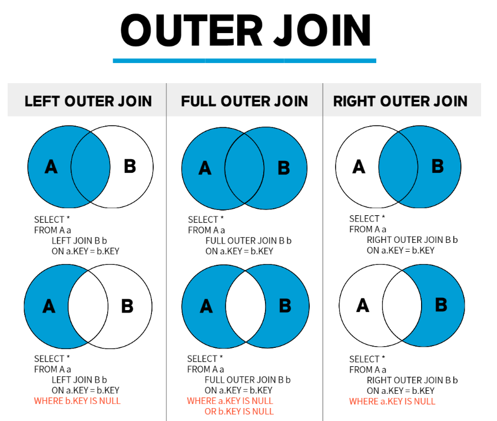
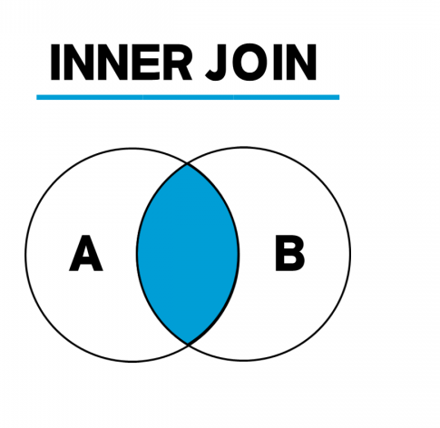
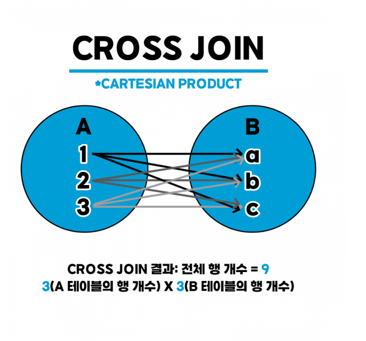

# JOIN 종류
## 헷갈리는 OUTER JOIN

## INNER JOIN
교집합

## CROSS JOIN
카티션 곱 (CARTESIAN PRODUCT)

## 출처
https://hongong.hanbit.co.kr/sql-%EA%B8%B0%EB%B3%B8-%EB%AC%B8%EB%B2%95-joininner-outer-cross-self-join/ 